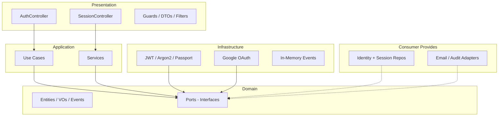

# Project Progress — `@jk/identity` v0.1.0

**Status:** 🚧 Under Active Development  
**Git:** 1 commit on `main`, pushed to [github.com/jKyle08/jk-identity](https://github.com/jKyle08/jk-identity)  
**Build:** ✅ Passes (`npm run build`)

---

## Overall Progress

The project is **beyond a bare scaffold** — it has a full Clean/Hexagonal architecture with working auth flows, but it is **not production-ready** yet. There are no tests, no reference adapters, and no CI.

| Area | Progress | Notes |
|------|----------|-------|
| Repo & docs | ✅ Done | README, LICENSE, CHANGELOG, CONTRIBUTING, ESLint/Prettier |
| Domain layer | ~90% | Entities, value objects, events, ports defined |
| Application layer | ~75% | Core use cases and services implemented |
| Infrastructure | ~60% | JWT, Argon2, Passport, Google OAuth; no DB adapters |
| Presentation (REST) | ~80% | Auth + session endpoints wired |
| Tests | 0% | No unit or integration tests |
| CI/CD | 0% | No GitHub Actions |
| Example / demo app | 0% | No consumer app in repo |

---

## What Is Implemented

### Domain (8 entities, 5 value objects, 10 events, 10 ports)

- **Entities:** `Identity`, `IdentityProvider`, `IdentitySession`, `RefreshToken`, `VerificationToken`, `PasswordResetToken`, `LoginHistory`, `SecurityEvent`
- **Ports:** Repository, email, audit, storage, SMS, hashing, tokens, events, auth providers

### Application (5 use cases + 5 services)

| Use Case / Service | Status |
|--------------------|--------|
| Register | ✅ Done |
| Login (with in-memory rate limiting) | ✅ Done |
| Logout / logout-all | ✅ Done |
| Change password | ✅ Done |
| OAuth login (Google) | ✅ Done |
| Email verification | ✅ Done |
| Password reset | ✅ Done |
| Session management (refresh, list, revoke) | ✅ Done |
| Token service | ✅ Done |

### Infrastructure

- Argon2 password hashing
- JWT access + refresh tokens
- Passport strategies: Local, JWT, Google
- In-memory event publisher
- Google OAuth provider

### REST API (`AuthController` + `SessionController`)

```
POST   /auth/register
POST   /auth/login
POST   /auth/logout
POST   /auth/logout-all
POST   /auth/verify-email
POST   /auth/resend-verification
POST   /auth/forgot-password
POST   /auth/reset-password
POST   /auth/change-password
POST   /auth/refresh
GET    /auth/google
GET    /auth/google/callback
GET    /sessions/me
GET    /sessions
DELETE /sessions/:sessionId
```

### Public API

`IdentityModule.register()`, guards, decorators, DTOs, exceptions, and a broad `index.ts` export surface.

---

## What Is Missing or Incomplete

### Required by Consumers (by design)

- `IdentityRepository` adapter
- `SessionRepository` adapter
- `EmailAdapter`, `AuditAdapter`
- Optional: `StorageAdapter`, `SmsAdapter`

### Features Not Yet Built

- Unlink provider use case (event exists, no flow)
- Additional OAuth providers (GitHub, Apple, etc.)
- Profile update / identity management endpoints
- Persistent rate limiting (currently in-memory in `LoginUseCase`)
- Distributed session store support
- SMS verification flow (port only)

### Quality & Delivery

- No tests (`*.spec.ts` / `*.test.ts`)
- No GitHub Actions (lint, build, test)
- No example NestJS app showing adapter wiring
- No npm publish setup beyond `prepublishOnly`

---

## Architecture Snapshot



---

## Suggested Next Steps (Priority Order)

1. **Reference adapters** — in-memory or Prisma/TypeORM implementations for local dev
2. **Example NestJS app** — show `IdentityModule.register()` end-to-end
3. **Unit tests** — use cases and services
4. **CI pipeline** — build + lint on PR
5. **Unlink provider** — complete account linking story
6. **Integration tests** — auth flows against reference adapters

---

## Bottom Line

You have a solid **v0.1.0 foundation**: architecture, core auth flows, and a publishable module shape. The main gap is **validation and consumability** — tests, reference adapters, and a demo app so others (or you) can run it without writing every adapter first.
