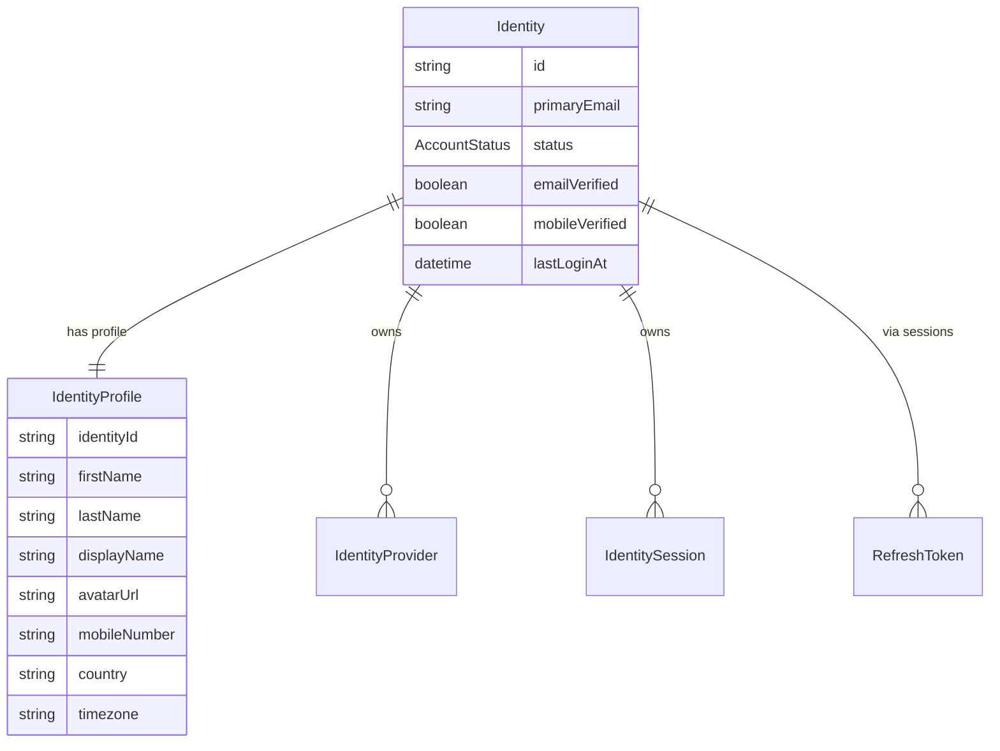
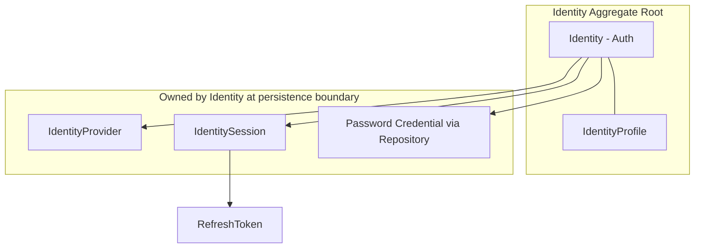
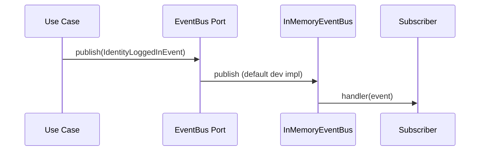

# JK Identity

A reusable, enterprise-grade Identity & Authentication package for NestJS applications using Clean Architecture and Hexagonal Architecture (Ports & Adapters).

**Package:** `@apxon-jk/identity`

> **Early access (v0.3.x)** — **Distribution:** Clone from [GitHub](https://github.com/jKyle08/jk-identity). npm registry publish is optional and planned later (requires npm 2FA). You must provide your own adapters (database, email, audit) for production. Memory adapters live under `examples/memory`. See [docs/integration.md](docs/integration.md) for clone, `file:`, and GitHub install options.

---

## Vision

Build authentication once and reuse it across every future application.

The package provides:

- Identity Management
- Authentication
- Sessions
- JWT
- OAuth
- Password Management
- Email Verification
- Password Reset
- Security
- Account Linking

The package does **not** contain business modules.

---

## Goals

- Database Agnostic
- ORM Agnostic
- Email Provider Agnostic
- Storage Agnostic
- Notification Agnostic
- Framework Friendly
- Modular
- Extensible
- Production Ready

---

## Architecture

This package follows:

- **Domain-Driven Design (DDD)** — aggregate roots, value objects, and domain events
- **Clean Architecture** — strict dependency rules between layers
- **Hexagonal Architecture (Ports & Adapters)** — infrastructure is pluggable via ports
- **Dependency Injection** — NestJS module system for composition and testability

### Layers

| Layer | Responsibility |
|-------|----------------|
| **Domain** | Entities, value objects, events, and port interfaces (no framework dependencies) |
| **Application** | Use cases and application services |
| **Infrastructure** | Adapters for JWT, OAuth, hashing, Passport strategies, and in-memory event bus |
| **Presentation** | REST controllers, DTOs, guards, and decorators |
| **Shared** | Base classes, constants, exceptions, and utilities used across layers |

---

## Domain Model (v0.2.0)

### Identity vs IdentityProfile

Authentication and profile data are **separate concerns** modeled as a one-to-one relationship inside the `Identity` aggregate root.

| Entity | Responsibility |
|--------|----------------|
| **Identity** | Authentication state: status, email verification, mobile verification, last login, lifecycle timestamps |
| **IdentityProfile** | Personal information: name, avatar, contact details, locale preferences |



**Design rule:** Authentication flows (`login`, `logout`, `change-password`) must not depend on profile fields. Profile data is loaded only when needed for responses or profile management.

### Aggregate Relationships



### Value Objects

Primitive strings are replaced with validated value objects where appropriate:

| Value Object | Purpose |
|--------------|---------|
| `Email` | Normalized, validated email addresses |
| `Password` | Password strength validation |
| `FullName` | First, middle, last name and suffix |
| `PhoneNumber` | Mobile and telephone numbers |
| `DisplayName` | Public display name |
| `Country` | ISO 3166-1 alpha-2 country codes |
| `Timezone` | IANA timezone identifiers |

### Audit Model

`LoginHistory` and `SecurityEvent` are unified into a single **`AuditEvent`** entity with an `AuditEventType` enum:

`LOGIN` · `LOGOUT` · `FAILED_LOGIN` · `PASSWORD_CHANGED` · `PASSWORD_RESET` · `EMAIL_VERIFIED` · `PROVIDER_LINKED` · `PROVIDER_UNLINKED` · `SESSION_CREATED` · `SESSION_REVOKED`

The `AuditAdapter` port interface is unchanged. Implement adapters using `AuditEvent` as the reference persistence model.

### Sessions

`IdentitySession` is extended for future device management:

- `deviceName`, `browser`, `operatingSystem`
- `ipAddress`, `country`
- `lastActivityAt`, `refreshTokenHash`

---

## Event Flow

Domain events are published through the **`EventBus`** port. The application layer never couples to a specific messaging implementation.



Subscribe to events via `IdentityService.onDomainEvent()` or provide a custom `EventBus` implementation (Redis, SNS, etc.).

| Event | Published By |
|-------|-------------|
| `identity.created` | Register, OAuth login |
| `identity.logged_in` | Login, OAuth login |
| `identity.logged_out` | Logout |
| `identity.password_changed` | Change password |
| `identity.password_reset` | Password reset |
| `identity.email_verified` | Email verification |
| `identity.provider_linked` | OAuth login |
| `identity.session_created` | Session service |
| `identity.session_revoked` | Session service |

---

## Ports & Adapters

Consumers implement required adapters and pass them to `IdentityModule.register()`.

| Port | Required | Purpose |
|------|----------|---------|
| `IdentityRepository` | Yes | Identity + profile persistence |
| `SessionRepository` | Yes | Sessions, refresh tokens, verification tokens |
| `EmailAdapter` | Yes | Transactional email |
| `AuditAdapter` | Yes | Security audit logging |
| `StorageAdapter` | No | Avatar upload |
| `SmsAdapter` | No | SMS OTP |
| `EventBus` | Built-in default | Domain event publishing |

### Future Extension Points (v0.2.0+)

Ports are defined but not yet implemented. Wire adapters when adding these features:

| Port | Future Feature |
|------|----------------|
| `PasskeyAdapter` | WebAuthn / Passkeys |
| `MfaAdapter` | Multi-factor authentication |
| `MagicLinkAdapter` | Passwordless magic links |
| `DeviceTrustAdapter` | Trusted device management |
| `AuthenticatorAdapter` | TOTP authenticator apps |

`ProviderType` already includes `passkey`, `magic_link`, and `phone_otp` for forward compatibility.

---

## Status

| | |
|---|---|
| **Current Version** | v0.3.0 |
| **Status** | Early access — clone-first, adapters required |
| **Distribution** | GitHub clone (`file:` / git install). npm optional later |

---

## Install

**Clone first** (recommended):

```bash
git clone https://github.com/jKyle08/jk-identity.git
cd jk-identity
npm install
npm run build
npm run playground   # try the API at http://localhost:3000
```

**Use in your own NestJS app** (sibling project):

```json
{
  "dependencies": {
    "@apxon-jk/identity": "file:../jk-identity/packages/identity",
    "@apxon-jk/identity-memory": "file:../jk-identity/examples/memory"
  }
}
```

See [docs/integration.md](docs/integration.md) for GitHub install, `npm link`, and tarball options.

**npm registry** (when published):

```bash
npm install @apxon-jk/identity
```

---

## Usage

```typescript
import { IdentityModule } from '@apxon-jk/identity';

@Module({
  imports: [
    IdentityModule.register({
      adapters: {
        identityRepository: new MyIdentityRepository(),
        sessionRepository: new MySessionRepository(),
        emailAdapter: new ResendEmailAdapter(),
        auditAdapter: new AuditAdapter(),
        storageAdapter: new SupabaseStorageAdapter(),
      },
      auth: {
        jwtSecret: process.env.JWT_SECRET!,
        jwtRefreshSecret: process.env.JWT_REFRESH_SECRET!,
        accessTokenExpiration: '15m',
        refreshTokenExpiration: '30d',
      },
      oauth: {
        google: {
          clientId: process.env.GOOGLE_CLIENT_ID!,
          clientSecret: process.env.GOOGLE_CLIENT_SECRET!,
        },
      },
    }),
  ],
})
export class AppModule {}
```

### Repository Migration (v0.1 → v0.2)

If you implemented `IdentityRepository` for v0.1.0, persist identity auth fields and profile fields in separate tables/columns. The `Identity` entity exposes both via convenience getters, and `Identity.fromCombinedProps()` helps map legacy flat rows.

---

## Development

```bash
npm install
npm run build
npm run lint
npm test
npm run playground   # http://localhost:3000 — Swagger at /api
npm run consumer     # external-app example at http://localhost:3001
npm run pack:identity   # create installable .tgz without npm registry
```

Copy `.env.example` to `.env` for JWT secrets when running locally.

### Documentation

See [docs/README.md](docs/README.md) for integration guides, adapter examples, and architecture.

Start with [docs/integration.md](docs/integration.md) for clone-first setup.

### Memory Adapters (local dev / testing — repo only)

Memory adapters are available when you **clone this repository**.

```typescript
import { createMemoryAdapters } from '@apxon-jk/identity-memory';
```

See [examples/memory/README.md](examples/memory/README.md).

---

## License

[MIT](LICENSE)
