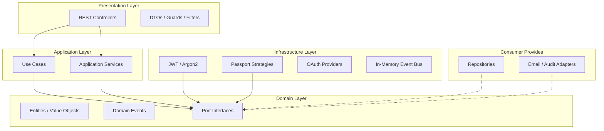

# Architecture

`@apxon-jk/identity` follows **Clean Architecture** and **Hexagonal Architecture (Ports & Adapters)**.

## Layer Overview



## Domain Layer

Pure TypeScript — no NestJS or database dependencies.

- **Entities:** `Identity`, `IdentityProfile`, `IdentitySession`, `RefreshToken`, etc.
- **Value Objects:** `Email`, `Password`, `AccountStatus`, `ProviderType`
- **Events:** `IdentityCreatedEvent`, `IdentityLoggedInEvent`, etc.
- **Ports:** Interfaces consumers implement (`IdentityRepository`, `EmailAdapter`, …)

The `Identity` aggregate root owns authentication state; `IdentityProfile` holds personal data in a 1:1 relationship.

## Application Layer

Orchestrates domain logic via use cases and services:

| Use Case | Responsibility |
|----------|----------------|
| `RegisterUseCase` | Create identity, hash password, send verification |
| `LoginUseCase` | Authenticate, create session, audit |
| `LogoutUseCase` | Revoke session(s) |
| `ChangePasswordUseCase` | Change password for authenticated user |
| `OAuthLoginUseCase` | Google OAuth sign-in / sign-up |

Services handle cross-cutting application concerns: tokens, sessions, email verification, password reset.

## Infrastructure Layer

Built-in adapters wired automatically by `IdentityModule`:

- Argon2 password hashing
- JWT access + refresh tokens
- Passport strategies (Local, JWT, Google)
- In-memory event bus

## Presentation Layer

REST API exposed when you import `IdentityModule.register()`:

- `AuthController` — `/auth/*`
- `SessionController` — `/sessions/*`

Guards (`JwtAuthGuard`), decorators (`@CurrentIdentity()`), and DTOs are exported from the public API.

## Dependency Rule

Dependencies point **inward**:

```
Presentation → Application → Domain ← Infrastructure (implements ports)
```

Consumer adapters implement domain ports and are injected at the module boundary.
