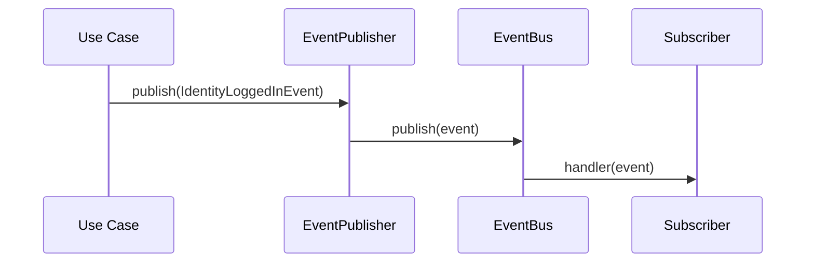

# Events

`@jk/identity` publishes **domain events** when significant identity actions occur. Future packages (billing, notifications, analytics) can subscribe without tight coupling.

## EventBus

The module wires an `InMemoryEventBus` by default. Subscribe via `IdentityService`:

```typescript
import { IdentityService, IdentityCreatedEvent } from '@jk/identity';

@Injectable()
export class OnboardingService {
  constructor(private readonly identityService: IdentityService) {}

  onModuleInit() {
    this.identityService.onDomainEvent('identity.created', (event) => {
      const created = event as IdentityCreatedEvent;
      console.log('New identity:', created.identityId, created.email);
    });
  }
}
```

For production, replace `InMemoryEventBus` with a distributed bus (Redis, RabbitMQ, SNS) by implementing the `EventBus` port.

## Domain Events

| Event | When |
|-------|------|
| `identity.created` | Registration or OAuth sign-up |
| `identity.logged_in` | Successful login |
| `identity.logged_out` | Logout or logout-all |
| `identity.email_verified` | Email verification completed |
| `identity.password_changed` | Authenticated password change |
| `identity.password_reset` | Password reset via token |
| `identity.provider_linked` | OAuth provider linked |
| `identity.provider_unlinked` | Provider unlinked (event defined; flow pending) |
| `identity.session_created` | New session created |
| `identity.session_revoked` | Session revoked |

## Event Flow



Use cases publish events **after** successful persistence. Subscribers should be idempotent and must not block the auth flow.

## Custom Subscribers

Inject `EVENT_BUS` for lower-level access:

```typescript
import { EVENT_BUS, EventBus } from '@jk/identity';

@Injectable()
export class AuditEventForwarder {
  constructor(@Inject(EVENT_BUS) private readonly eventBus: EventBus) {}

  onModuleInit() {
    this.eventBus.subscribe('identity.logged_in', (event) => {
      // Forward to external analytics
    });
  }
}
```
